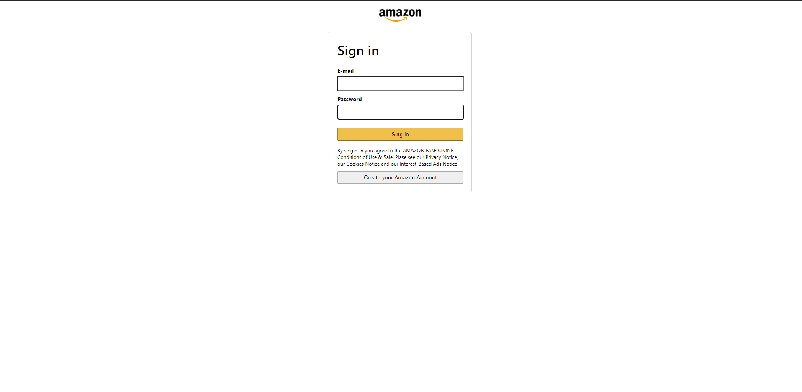
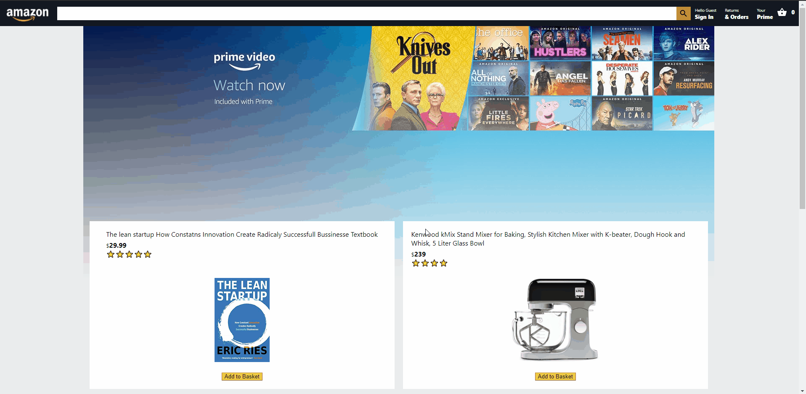
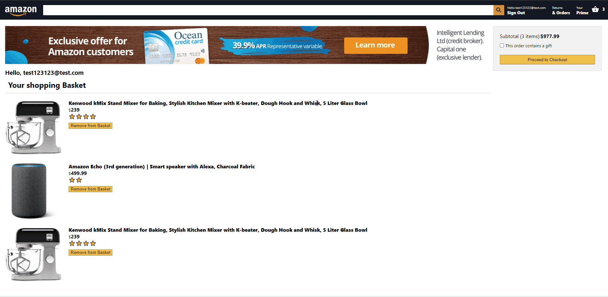
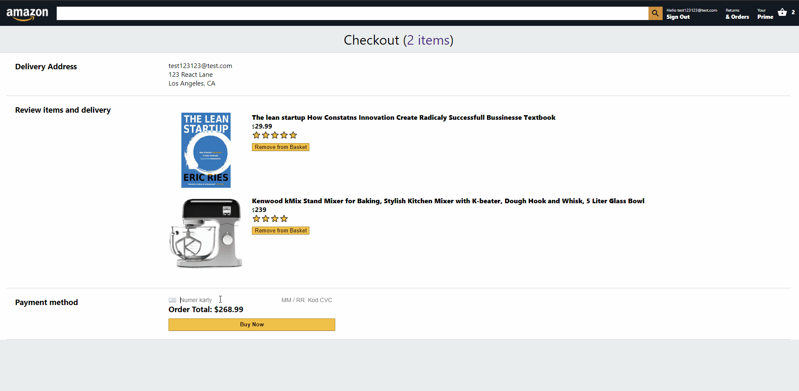

# Amazon Clone

- React JS
- FireBase Authentication (logowanie i tworzenie konta na podstawie emaila i hasła)
- FireBase Functions - backend
- Prawdziwe Płatności (wykorzystując Stripe) [Link](https://stripe.com/en-pl)

- hosting Firebase [LIVE DEMO](https://clone-24fe3.web.app/)

# Do testowania płatności użyj:

- Nr karty: 4242 4242 4242 4242
- MM/RRR: 04/24
- CVC: 242
- Kod pocztowy: 42424

# Możliwości:

- Logowanie oraz zakladanie konta
  
- Dodawanie do koszyka
  
- Usuwanie z koszyka
  
- Prawdziwe platności (w polu nr karty kredytowej podaj 4242424242424242)
  
